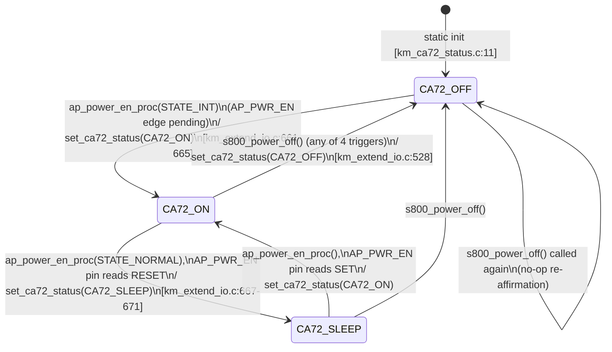
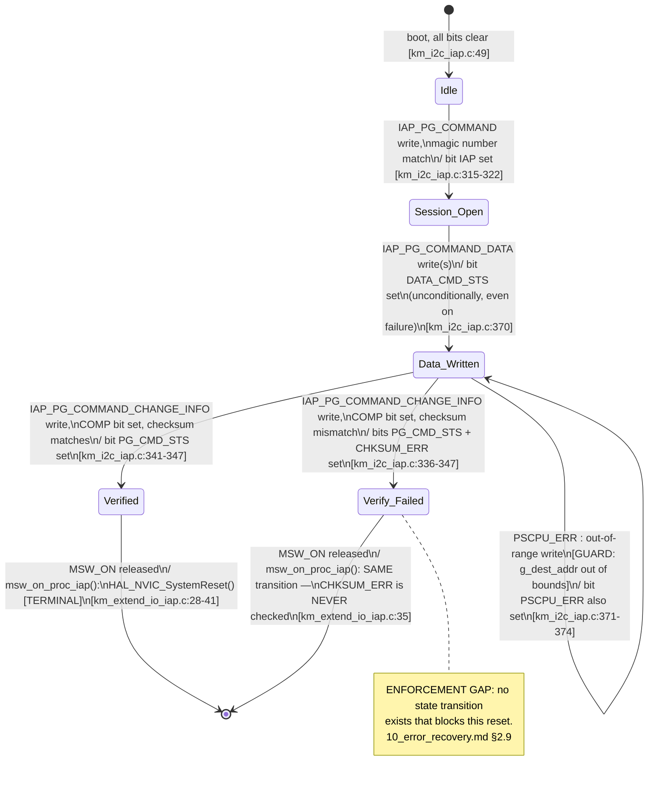

# Sơ đồ trạng thái — State Machine Ứng dụng (Application)

**Danh mục: State machine Ứng dụng.** Hai state machine được sở hữu bởi
logic ở cấp ứng dụng chứ không phải một driver/ngoại vi: trạng thái CA72,
và bitmask trạng thái cập nhật firmware IAP. Nguồn: `07_state_machines.md`
§1.4, §1.7.

## 4a. Trạng thái CA72 (bộ xử lý ứng dụng)

## Ghi chú — các transition không được thực thi cưỡng chế + state phát hiện cạnh ẩn

`set_ca72_status()` (`km_ca72_status.c:22-26`) ghi đè vô điều kiện —
**mọi mũi tên ở trên là một quy ước của bên gọi, không phải một điều kiện
bảo vệ mà setter thực thi cưỡng chế.** Ngoài ra,
`sleep_status_rem_eagle_proc()`/`_sparrow_proc()` mỗi hàm đều giữ một
**biến `static prev_status` riêng** (`km_extend_io.c:892-893,968-969`) để
phát hiện *cạnh* chuyển tiếp `ON→SLEEP`/`SLEEP→ON` — đây là một phần bộ
nhớ state machine thứ hai, độc lập, không được thể hiện trong sơ đồ ở
trên vì nó thuộc về bên tiêu thụ (consumer), không thuộc về bản thân
`km_ca72_status.c`; xem `07_state_machines.md` §1.4 để có thảo luận đầy
đủ, bao gồm cả tình trạng dữ liệu cũ đi một vòng lặp mà điều này gây ra.

Không có hành động entry/exit, không có timeout, không có state lỗi nào
tồn tại cho state machine này.

## 4b. Trạng thái cập nhật firmware IAP (tổ hợp bit, bán tường minh)

Không phải một phép phân hoạch thành các state rời rạc — mà là một
bitmask `uint32_t` (`g_iap_reg[CHANGE_STATUS]`) với 5 bit có thể đặt độc
lập. Được thể hiện dưới dạng các tổ hợp có thể đạt tới trên thực tế, theo
thứ tự chúng tích lũy:

Không có transition nào quay trở lại một tổ hợp thấp hơn được lập trình ở
bất kỳ đâu — chỉ có một reset toàn bộ (E1-E4) mới xóa các bit này thông
qua việc khởi tạo lại BSS. Không có retry nào tồn tại; các "state lỗi"
(self-loop PSCPU_ERR của `Data_Written`, `Verify_Failed`) là các ngõ cụt
gần như terminal mà master phải tự nhận biết từ bên ngoài.

## Truy vết

| Machine | Function | File:Line |
|---|---|---|
| CA72 status | `set_ca72_status`, `get_ca72_status` | `main/App/km_ca72_status.c:22,37` |
| IAP status bits | `i2c_recv_wait` (IAP) | `iap/App/km_i2c_iap.c:315-374` |
| IAP reset gate | `msw_on_proc_iap` | `iap/App/km_extend_io_iap.c:28-41` |
